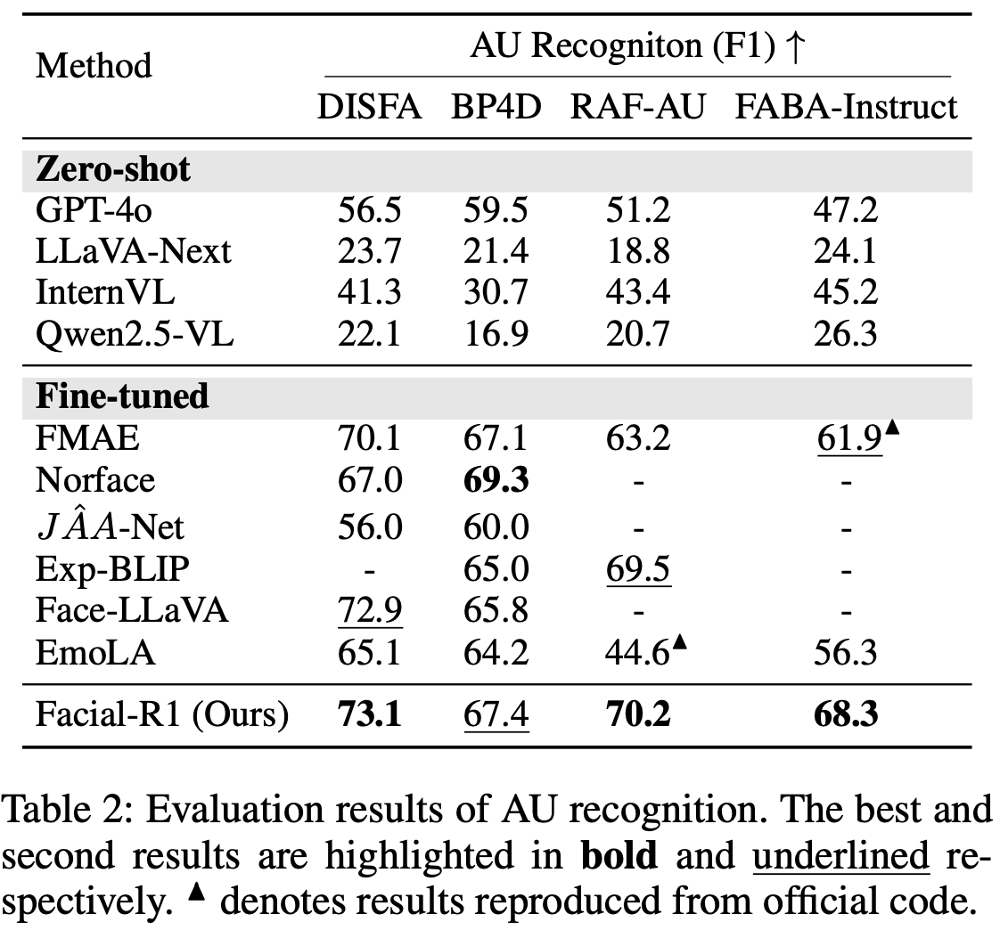
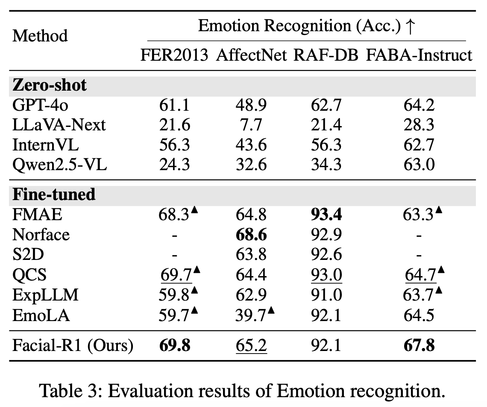
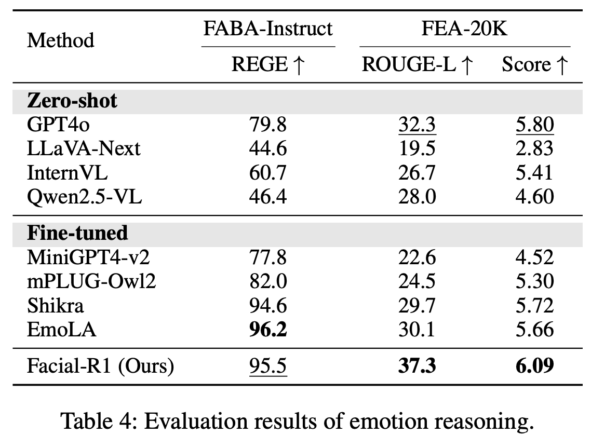

<p align="center">
  <h2 align="center">[AAAI 2026] Facial-R1: Aligning Reasoning and Recognition for Facial Emotion Analysis
</h2>
  <p align="center">
    <a><strong>Jiulong Wu<sup>1,2*</sup>, </strong></a>
    <a><strong>Yucheng Shen<sup>1*</sup>, </strong></a>
    <a><strong>Lingyong Yan<sup>2</sup>, </strong></a>
    <a><strong>Haixin Sun<sup>1</sup></strong></a>
    <br>
    <a><strong>Deguo Xia<sup>2</sup>, </strong></a>
    <a><strong>Jizhou Huang<sup>2</sup>, </strong></a>
    <a><strong>Min Cao<sup>1†</sup></strong></a>
    <br>
    <sup>1</sup> Soochow University      <sup>2</sup> Baidu Inc.
    <br>
    <sup>*</sup>Equal contribution        <sup>†</sup>Corresponding author
    </br>
    </br>
        <a href="#">
        </a>
        <a href="https://huggingface.co/datasets/QBiscuits/FEA-20K">
        </a>
        <a href="#">
        </a>

</p>
</p>

## Overview

This project introduces **Facial-R1**, an R1-style Large Vision-Language Model specialized for aligning reasoning and recognition in facial emotion analysis. By leveraging a novel three-stage training framework, Facial-R1 demonstrates significant improvements in understanding and interpreting the nuanced details of facial expressions, including Action Units (AUs) and emotional states.


The Facial-R1 framework consists of three stages: (1) **Supervised finetuning** (SFT) mitigates hallucinations by establishing basic emotion reasoning capability; (2) **Reinforcement Learning** (RL) leverages verifiable emotional facts as reward signals to build reasonable and flexible reasoning process; (3) **Data Synthesis** iteratively leverages the prior two stages to expand the training dataset, enabling scalable self-improvement of the model.

## 🚀 Features

This repository supports:

* **`Supervised Fine-tuning (SFT)`**: A script to train a foundational model using specialized prompts to inject prior knowledge of facial analysis. See `run_scripts/sft_emotion.sh`.
* **`Reinforcement Learning with GRPO`**: Scripts to perform GRPO training using verifiable rewards (AUs, emotion accuracy, format) to enhance the model's reasoning. See `run_scripts/grpo_emotion.sh`.
* **`Iterative Data Synthesis`**: A workflow to generate high-quality data and iteratively retrain the model for continuous performance gains.
* **`Custom Data Integration`**: Easily train the model on your own datasets by following our specified JSONL format.

## 🤖 Methodology

Our Facial-R1 framework is composed of three distinct stages designed to progressively build a robust and interpretable emotion analysis model.

### Stage 1: Supervised Fine-tuning (SFT)

To mitigate reasoning hallucinations and establish a baseline understanding, we first fine-tune the VLM with a small set of high-quality, instruction-based samples. These instructions, generated by GPT-4o-mini, embed essential domain knowledge, such as Action Unit (AU) definitions, teaching the model the foundational relationships between facial features and emotions.

### Stage 2: Reinforcement Learning (RL) with Verifiable Rewards

This is the core training stage. We use the GRPO (Generalized Reinforcement Learning from Preference Observations) algorithm to refine the model's reasoning process. To guide the training, we design a composite reward function based on verifiable emotional factors:

$$
R = R_{AU} + R_{acc} + R_{format}
$$

* **AU Reward ($R_{AU}$)**: Calculated as the F1-score between the predicted and ground-truth AUs.
* **Accuracy Reward ($R_{acc}$)**: A binary reward for the final emotion label.
* **Format Reward ($R_{format}$)**: A binary reward that encourages structured output.

### Stage 3: Iterative Data Synthesis and Expansion

To overcome the scarcity of detailed emotion reasoning data, we implement an iterative self-improvement loop. The model trained in the prior stages is used to synthesize a new, larger dataset (**FEA-20K**). This data undergoes rigorous quality control before being used to retrain the model in a virtuous cycle of improvement.

## 📊 Experiments and Results

We conducted a comprehensive set of experiments to validate the effectiveness of Facial-R1 on three key tasks: AU Recognition, Emotion Recognition, and Emotion Reasoning.

### Datasets and Metrics

We use a wide range of public datasets (DISFA, BP4D, RAF-AU, FER2013, AffectNet, RAF-DB) and our own **FEA-20K** dataset. Evaluation is performed using the F1-score for AU recognition, Accuracy for emotion recognition, and task-specific metrics (REGE, ROUGE-L, GPT-4o-mini score) for reasoning. To protect copyright, we only provide data annotations in the [huggingface (QBiscuits/FEA-20K)](https://huggingface.co/datasets/QBiscuits/FEA-20K) and do not include face images. Those who need the images should download them from the original data sources.

### Main Results

Facial-R1 demonstrates state-of-the-art or highly competitive performance across all tasks, consistently outperforming both zero-shot general VLMs and fine-tuned specialized models.

* **AU Recognition**: Facial-R1 achieves the highest F1-scores on DISFA (73.1%) and RAF-AU (70.2%), and the second-best score on BP4D (67.4%).

  
* **Emotion Recognition**: The model attains SOTA accuracy on FER2013 (69.8%) and FABA-Instruct (67.8%), while remaining highly competitive on AffectNet and RAF-DB.

  
* **Emotion Reasoning**: Facial-R1 significantly outperforms all other methods on our challenging FEA-20K benchmark, achieving the highest ROUGE-L (37.3) and GPT-based score (6.09).

  

## 🛠️ Setup

```bash
conda create -n facial-r1 python=3.10
conda activate facial-r1
bash setup.sh
```

## 💪🏻 Training Workflow

The training process reflects our three-stage methodology. The provided scripts allow you to replicate this workflow. We provide FABA, BP4D, DISFA, RAF-AU, FER2013, AffectNet, and RAF-DB. File suffixes stage1, stage2, and stage3 correspond to training steps 1, 2, and 3 respectively. The sum of all training datasets from stage1 constitutes the training set of our FEA-20K dataset, while the sum of all test sets forms the test set of FEA-20K.

### Step 1: Supervised Fine-tuning (SFT)

First, we build a foundational model using all datasets: FABA, BP4D, DISFA, RAF-AU, FER2013, AffectNet, and RAF-DB.

```bash
# Train the SFT model using the full dataset.
bash run_scripts/sft_emotion.sh
```

### Step 2: GRPO Training

Next, we refine the model's reasoning with GRPO using all datasets: FABA, BP4D, DISFA, RAF-AU, FER2013, AffectNet, and RAF-DB.

```bash
# Run GRPO training. The script should be configured to use the desired dataset(s).
bash run_scripts/grpo_emotion.sh
```

### Step 3: Task-Specific Enhancement

To achieve the best possible performance on a specific benchmark, you can continue GRPO training for 10 iterations on a specific dataset like RAF-DB. Training on **8✖️A800 GPUs** takes approximately **240 hours**.

```bash
# To fine-tune on a specific dataset, modify the data_paths and image_folders
bash run_scripts/grpo_emotion.sh
```

## 📈 Evaluation

To evaluate your trained models, you can use the provided evaluation script. Make sure to specify the path to your model checkpoint and the dataset you want to evaluate on.

```bash
# Evaluate a trained model on a specific dataset.
bash run_scripts/eval_emotion.sh
```

## Checkpoints

We provide the checkpoints for our Facial-R1 models.

| Model                               | Description                                                                       | Download           |
| :---------------------------------- | :-------------------------------------------------------------------------------- | :----------------- |
| **Facial-R1 (SFT)**           | The foundational model after the Supervised Fine-tuning stage.                    | [Link-to-be-added] |
| **Facial-R1 (GRPO)**          | The final model after Reinforcement Learning, trained on all datasets.            | [Link-to-be-added] |
| **Facial-R1 (GRPO + RAF-DB)** | The model further fine-tuned on the RAF-DB dataset for task-specific enhancement. | [Link-to-be-added] |

## For Your Own Data

You can easily train Facial-R1 on your own datasets by formatting your data into our standardized JSONL structure.

### Data Format

Each line in your `.jsonl` file should be a JSON object with the following structure.

```json
{
  "id": "unique_sample_id_string",
  "dataset": "your_dataset_name",
  "image": "path/to/image.jpg",
  "question": "A natural language question, e.g., 'Analyze the facial expression in the image.'",
  "AUs": ["AU1", "AU4"],
  "labels": ["Sadness"],
  "description": "A textual description of the reasoning or emotion.",
  "meta_info": {"key": "value"}
}
```

> [!NOTE]
> The image path in the JSONL file should be relative to the image folder specified in `--image_folders`.

### Implementation Details

Facial-R1 is built upon **Qwen2.5-VL-7B**. We use full-parameter fine-tuning with 16-bit mixed precision and DeepSpeed ZeRO-3. Experiments were run on 8x NVIDIA A800-80GB GPUs. Key hyperparameters include a learning rate of 2e-5, a batch size of 8, and a gradient accumulation of 4 steps.

> [!NOTE]
> The data (JSONL files) used for our experiments will be provided to reviewers for reproducibility purposes.

## 🤝 Acknowledgements

We would like to express our sincere gratitude to the creators of VLM-R1.

## ⭐️ Citation

If you find this project useful for your research, please consider citing our work.

```bib

```
